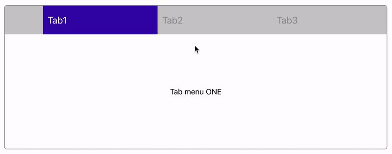
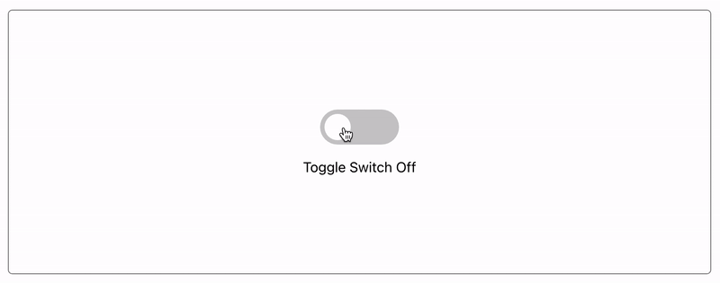

# wanted_pre_onboarding

* 제출자 강현영

 

# 구현 컴포넌트 목록

* [Tab](#Tab)
* [Modal](#Modal)
* [ClickToEdit](#ClickToEdit)
* [Toggle](#Toggle)

 

# Tab

## 구현 방법

* 탭 버튼 영역
  * div 태그와 p 태그로 구성
  * 태그 내부에 data set 활용해, 버튼을 누르면 보여줄 탭 내용 영역의 id와 동일한 id 작성/연결
* 탭 내용 영역
  * div 태그와 p 태그로 구성
  * 탭과 연결하기 위한 id 지정

## Error Handling Log

### 💬 이벤트 처리 고민

* 탭 버튼 영역의 div 태그 또는 p태그를 눌렀을 때, 두 경우 모두 이벤트 처리를 해야 함

### 💡고민 해결 방안

* div 태그에 onClick 이벤트 달기

* currentTarget 사용하기

  ➞ 만약 p 태그를 눌렀을 경우에도, currentTarget을 통해 이벤트를 달고 있는 div 태그를 선택할 수 있도록 해 이벤트 함수가 정상적으로 동작되도록 해결

### 💬 탭 클릭 시 효과 고민

* 탭 클릭 또는 해제 시 배경색과 글자색 전환
* 선택된 하나의 탭만 active일 수 있도록 관리해야 함

### 💡고민 해결 방안

* forEach문을 통해 모든 탭의 active 여부 확인
* forEach문을 돌며 현재 클릭된 탭의 id와 같은 경우 active를 add, 나머지는 remove

 

# Modal

## 구현 방법

* Open Modal 버튼
  * 버튼 클릭 후 모달 클래스의 hidden 비활성화, 모달창 띄우기
* 모달
  * 버튼 누르기 전에는 hidden 활성화 상태, 보이지 않음

## Error Handling Log

### 💬 모달 position 고민

* 여러 요소들이 겹치기 때문에 위치 충돌 발생

### 💡고민 해결 방안

* 전체를 감싸는 border-box의 relative 속성을 기준으로, 아래 모달 요소들은 absolute로 위치를 잡아 충돌 해소

 

# ClickToEdit

## 구현 방법

> input 태그 바깥을 클릭해, input 값을 적용하는 것으로 판단

* 이름, 나이 input 영역
  * 유저의 input을 받아 inputName, inputAge라는 변수로 갖고 있음
* 이벤트 감지 영역
  * body에 달린 이벤트 리스너가 mousedown을 감지하면 이벤트 함수 실행
* input 값 적용 영역
  * 이벤트 함수 실행을 통해 useState 함수로 변수값 관리

## Error Handling Log

### 💬 이벤트 감지 고민

* input을 제외한 영역을 클릭하면 값 변경, 외부에 이벤트 리스너를 어떤 방식으로 달아주어야 하는지 고민

### 💡고민 해결 방안

* body에 이벤트 리스너를 달아서 클릭 감지할 수 있도록 해 값 변경

 

# Toggle

## 구현 방법

* Toggle 버튼 이동
  * input과 label을 연결해 클릭 감지, 이동 효과 주기
* 텍스트 변경
  * useState를 사용해, 클릭 감지 후 이벤트 함수를 통해 텍스트 변경

## Error Handling Log

### 💬 이벤트 감지 고민

* 텍스트 변경에만 useState를 설정해주니, 정작 텍스트 변경의 기준이 되는 checkstate의 true/false 변경이 제때 이루어지지 않아 텍스트와 Toggle 버튼의 동기화가 이루어지지 않음

### 💡고민 해결 방안

* checkState 또한 useState로 관리해 동일하게 변경될 수 있도록 함

 